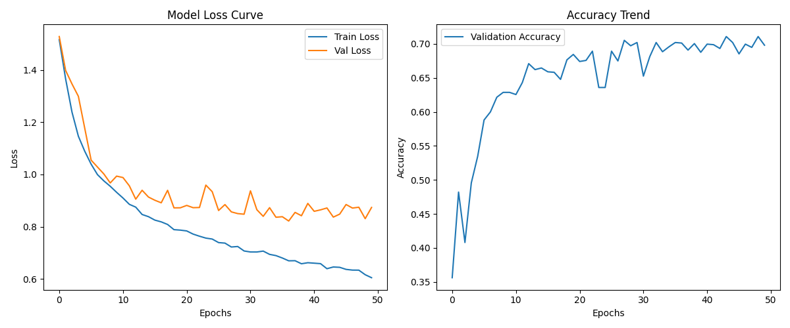
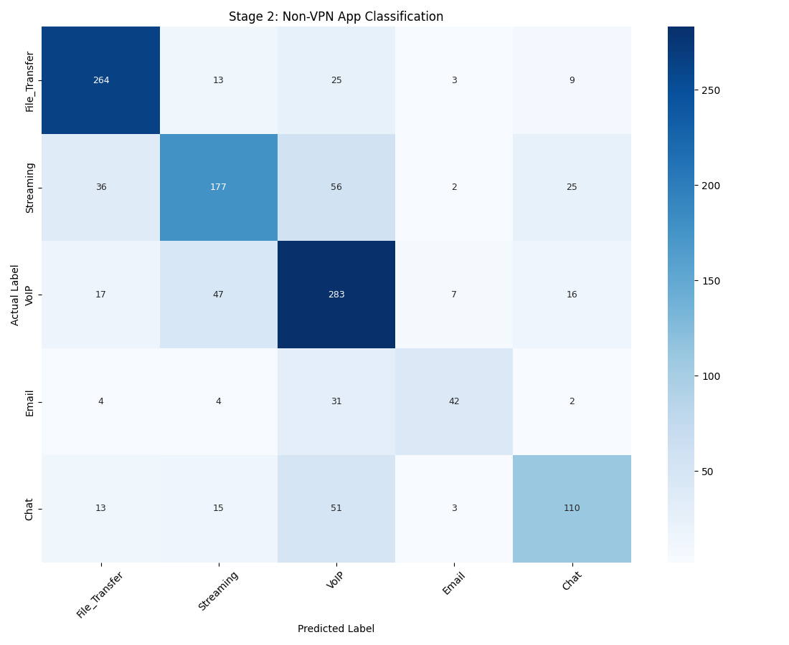

# 🔬 流量识别实验报告 - Scenario A (Stage 2 - Non-VPN Expert)

## 1. 实验环境与配置
- **任务**: Stage 2 - Non-VPN Expert 流量分类
- **架构**: 1D-CNN + Transformer 融合网络 (双轨特征)
- **流超时 (Timeout)**: 15 Seconds

## 2. 核心性能指标
| 指标 (Metric) | 数值 (Value) |
| :--- | :--- |
| **准确率 (Accuracy)** | 0.6980 |
| **宏平均 F1 (Macro F1)** | 0.6742 |
| **最终验证集 Loss** | 0.8739 |

## 3. 各类别性能明细
| 类别 | Precision | Recall | F1-score | Support |
| :--- | :--- | :--- | :--- | :--- |
| File_Transfer | 0.7904 | 0.8408 | 0.8148 | 314.0 |
| Streaming | 0.6914 | 0.5980 | 0.6413 | 296.0 |
| VoIP | 0.6345 | 0.7649 | 0.6936 | 370.0 |
| Email | 0.7368 | 0.5060 | 0.6000 | 83.0 |
| Chat | 0.6790 | 0.5729 | 0.6215 | 192.0 |

## 4. 详细分类评估文本
```text
               precision    recall  f1-score   support

File_Transfer       0.79      0.84      0.81       314
    Streaming       0.69      0.60      0.64       296
         VoIP       0.63      0.76      0.69       370
        Email       0.74      0.51      0.60        83
         Chat       0.68      0.57      0.62       192

     accuracy                           0.70      1255
    macro avg       0.71      0.66      0.67      1255
 weighted avg       0.70      0.70      0.69      1255

```

## 5. 数据可视化
### 5.1 学习曲线


### 5.2 混淆矩阵

