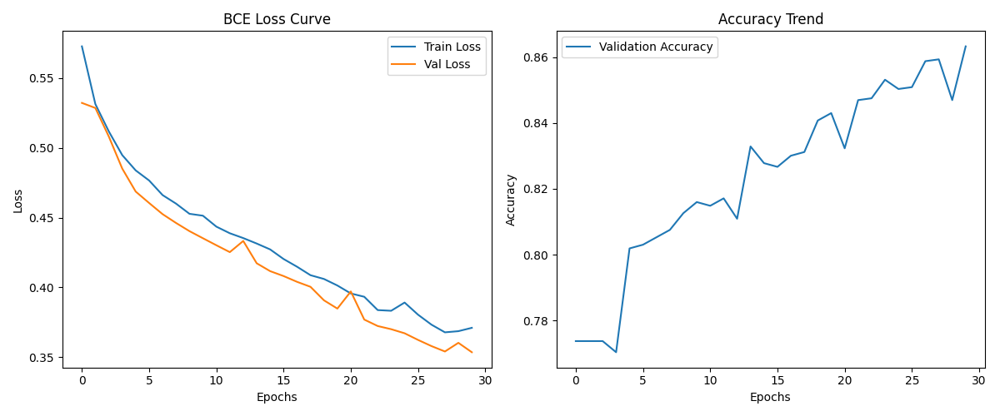
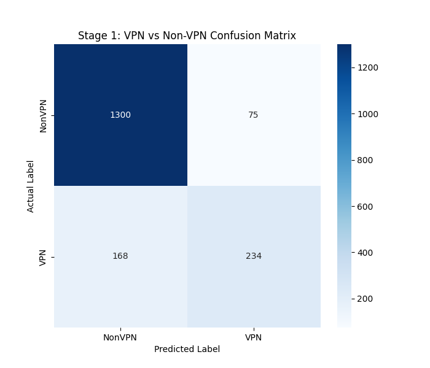

# 🔬 流量识别实验报告 - Scenario A (Stage 1)

## 1. 实验环境与配置
- **任务**: 区分 VPN 与 Non-VPN 流量 [cite: 131, 135]
- **架构**: 1D-CNN + Transformer 融合网络
- **流超时 (Timeout)**: 15 Seconds [cite: 207, 209]

## 2. 核心性能指标
| 指标 (Metric) | 数值 (Value) |
| :--- | :--- |
| **准确率 (Accuracy)** | 0.8633 |
| **宏平均 F1 (Macro F1)** | 0.7864 |
| **VPN 识别率 (Recall)** | 0.5821 |
| **最终验证集 Loss** | 0.3536 |

## 3. 详细分类评估
```text
              precision    recall  f1-score   support

      NonVPN       0.89      0.95      0.91      1375
         VPN       0.76      0.58      0.66       402

    accuracy                           0.86      1777
   macro avg       0.82      0.76      0.79      1777
weighted avg       0.86      0.86      0.86      1777

```

## 4. 数据可视化
### 4.1 学习曲线


### 4.2 混淆矩阵

